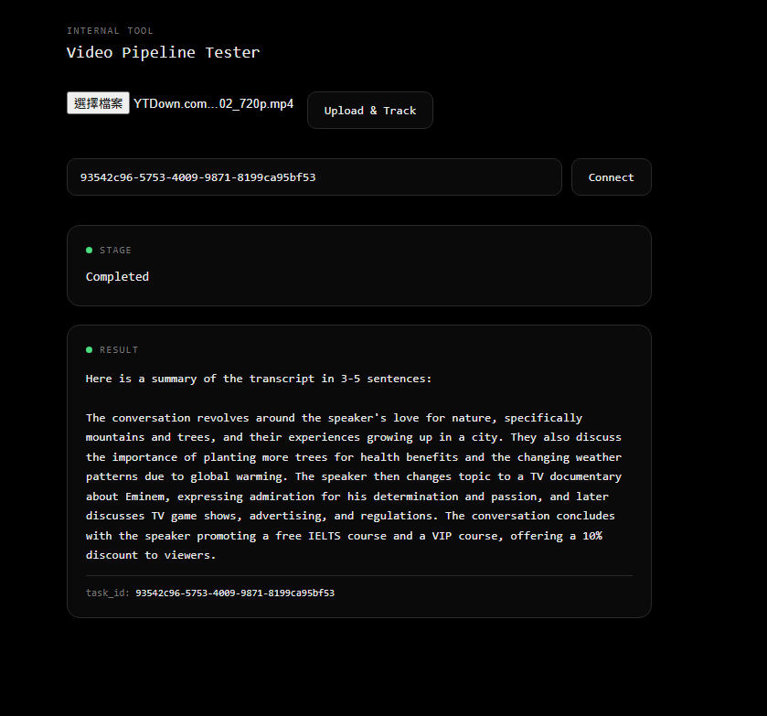

<a id="readme-top"></a>

<h1 align="center">Piroo</h1>

<p align="center">
  Video to summary · Kubernetes · Backend engineering · MLOps
</p>

<p align="center">
  <a href="docs/project-description.md"><strong>Explore the full documentation »</strong></a>
  <br />
  <a href="docs/evidence/README.md">Deployment screenshots</a>
  ·
  <a href="docs/model-evaluation.md">Model release evidence</a>
  ·
  <a href="https://github.com/SIU1006/Piroo/issues">Report an issue</a>
</p>

<details>
  <summary>Contents</summary>
  <ol>
    <li><a href="#about-the-project">About the project</a></li>
    <li><a href="#why-this-architecture">Why this architecture?</a></li>
    <li><a href="#kubernetes-deployment-and-operations">Kubernetes deployment and operations</a></li>
    <li><a href="#backend-and-model-engineering">Backend and model engineering</a></li>
    <li><a href="#getting-started">Getting started</a></li>
    <li><a href="#built-with">Built with</a></li>
  </ol>
</details>

## About the project

Upload a video or audio file and receive an AI-generated summary. Piroo extracts audio, transcribes it with Whisper, and summarises it with a locally hosted language model. Background workers process the file and deliver the result to the browser.

The main engineering focus is **Kubernetes deployment and operations**, supported by backend failure handling and reproducible model releases.

<details>
  <summary>View a completed upload</summary>



</details>

## Why this architecture?

Transcription and summarisation take time. Separating the upload API from processing lets the API accept jobs without waiting for inference, while workers handle the expensive steps independently.

```text
Upload → FastAPI → Redis queue → Celery worker → Whisper → LLM summary
             │                       ↑                        │
             └── S3 / MinIO storage ──┘              Result → Browser
```

Object storage lets workers fetch files from any node. A separate inference service keeps model releases independent of the API and worker code.

## Kubernetes deployment and operations

The platform runs as separate API, worker and inference deployments, with Helm configurations for local **kind** and **AWS EKS**.

- **Infrastructure and GitOps:** Terraform provisions AWS infrastructure; Argo CD reconciles Helm deployments from Git into separate staging and production namespaces.
- **Scaling with demand:** worker autoscaling uses Redis queue depth alongside CPU, so a growing backlog can trigger more workers even when they are waiting on inference.
- **Operational visibility:** Prometheus, Grafana and Alertmanager expose task metrics and alert rules. Health probes and resource limits help Kubernetes manage workloads.
- **Controlled releases:** CI validates code, integrations, Helm, Terraform and model regressions before image publication. Separate stable and candidate inference services isolate model evaluation traffic.

[View the recorded EKS deployment](docs/evidence/README.md) · [Kubernetes setup guide](docs/project-description.md#option-b--kubernetes-kind-cluster)

## Backend and model engineering

- **Controlled background processing:** retries for temporary failures and a shared admission limit prevent unlimited job acceptance. A status API reports queued, running, completed or failed jobs; WebSockets deliver results, with cached results available after reconnecting.
- **Reproducible model releases:** baseline and candidate use the same evaluation examples. MLflow tracks results, promotion requires fresh evaluation, and committed evidence follows a model through deployment, verification and rollback.

## Getting started

Install **Git and Docker Desktop**, then run:

```bash
git clone https://github.com/SIU1006/Piroo.git
cd Piroo
docker compose up --build --wait
```

Open **[localhost:8000](http://localhost:8000)**, upload a short audio or video file, and wait for its summary. No AWS account or GPU is required. The first start builds images and downloads models; allow several minutes and several gigabytes of disk space.

Stop the stack with `docker compose down`.

## Built with

- **Backend:** Python, FastAPI, Celery, Redis, S3/MinIO
- **ML:** BentoML, Ollama, MLflow
- **Platform:** Docker, Kubernetes, Terraform, Helm, Argo CD, GitHub Actions, Prometheus, Grafana

Built for private portfolio demos. Capacity measurements, setup details and known limitations are in the **[full project description](docs/project-description.md)**.

[MIT License](LICENSE) · [Back to top](#readme-top)
